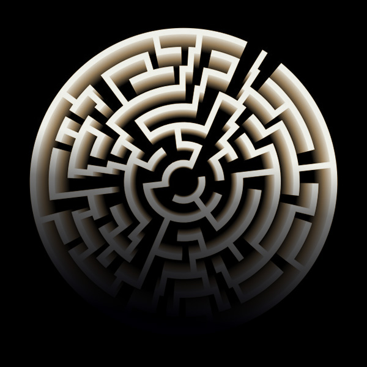

# VR-Projekt: ***BLACKOUT***

**Gruppenmitglieder:**
Patrick Dangel, Joe Franz, Tilman Hegge, Felix Mann, Tim Rittig

**Aktuelle Version des Projektes:**
[Link zum Drive-Ordner mit den aktuellen Versionen](https://drive.google.com/drive/folders/1VMocU3wB3z-aalVIfblXpI-GRI-o9RNh?usp=sharing)

## Dokumentation

**Projektidee:**
- Unser VR-Projekt ***Blackout*** visualisiert eine interaktive 3D-Virtual-Reality-Umgebung in Form eines Spiels.
- Das Spiel basiert auf keiner Geschichte öder ähnlichem, sondern ist komplett von uns selbst konzeptioniert worden.
- Das Spiel findet hauptsächlich in einer dunklen Weltraumstation statt.
- Wir haben uns dafür entschieden, dem Projekt den Titel ***Blackout*** zu geben, um zu verdeutlichen, dass das Spiel einen düsteren Ton anschlägt. Des Weiteren ist *Blackout* englisch und bedeutet so viel wie *Stromausfall* oder *Verdunkelung*, was die Thematik des Spiels sehr gut trifft.
- Dabei haben wir uns besonders auf Sounds und die Erzeugung der Atmosphäre und weniger auf die visuelle Darstellung fokussiert: Durch die schlichte, düstere Spielwelt, sollen die Sci-Fi-artigen Sounds eine größere Wirkung auf den Spieler haben. So soll innerhalb des Spiels durch Konzentrieren auf einzelne Sounds ein Weg durch ein Labyrinth gefunden werden.

**Artwork:**
- Das Logo und das Titelbild des Spiels haben wir mithilfe von **Adobe Photoshop** erstellt.
- Durch das Labyrinth im Logo (Bild 1) soll eine erste Anspielung auf das Labyrinth-artige Leveldesign in **BLACKOUT** geschaffen werden.
- Durch das mysteriöse Design des Titelbilds (Bild 2) soll der Spieler direkt auf die eher düstere Atmosphäre und die dunkle Umgebung des Spiels eingestellt werden. Das Design wurde absichtlich schlicht gehalten, da auch innerhalb des Spiels mehr Wert auf das Auditive als auf das Visuelle gelegt wurde, da der Großteil des Spiels im Dunkeln stattfindet. Auch im Titelbild ist das Labyrinth-artige Logo verarbeitet.

**Programmierung:**
- Das Projekt wurde als Desktop-Anwendung für den **Computer** programmiert.
- Für die Programmierung unseres Projektes haben wir uns für die Verwendung von **Unity** entschieden: Eine Entwicklungsumgebung, die die Entwicklung von Computerspielen und anderer interaktiver 3D-Grafik-Anwendungen ermöglicht.

**Modellierung:**
- Die im Spiel verwendeten Modelle haben wir lizenzfrei von Plattformen wie **Sketchfab**, **Turbosquid** und aus dem **Unity Asset Store** heruntergeladen.

**Musik, Sounds und Voice Overs:**
- Die Musik, Sounds und Voice Overs im Spiel haben wir mithilfe der Programme **Logic Pro**, einer Digital Audio Workstation des Herstellers Apple, und **Final Cut Pro**, einer Videoschnitt-Software, die auch zum Anfertigen und Bearbeiten von Audio-Inhalten geeignet ist, erstellt bzw. eingesprochen.
- Die Musik soll zur düsteren Atmosphähre beitragen und die Sounds sollen dem Spieler ein realistischeres Gefühl der Interaktion innerhalb der Sci-Fi-Welt geben bzw. die Immersion verstärken.
- Die Dialoge der Voice Overs haben wir selbst formuliert. Sie sollen einen engeren Bezug zu den Charakteren schaffen und dem Spieler Informationen zum Geschehen im Spiel liefern.

**Intro:**
- Das Intro besteht aus einem schwarzen Screen, bei dem lediglich Sounds und Voice Overs zu hören sind. Dadurch soll dem Spieler ein Gefühl der Einsamkeit und Ungewissheit vermittelt werden.
- Der Spieler erfährt im Intro, dass etwas auf der Raumstation passiert ist. Da das Funksignal gestört ist muss er zurück auf die Raumstation und nachsehen, was dort vorgefallen ist.

**Spielwelt:**
- Sobald das Intro endet, befindet sich der Spieler im Spielbereich. Dieser ist eine Raumstation, die aus 3 begehbaren Räumen und einem großen Labyrinth-artigen Gangsystem besteht.
- Zu Beginn steht der Spieler im Anfangsraum und kann nach erfolgreicher Kontaktaufnahme mit dem Captain Informationen zur aktuellen Lage empfangen. Da der Strom innerhalb der Raumstation ausgefallen ist und der Captain dadurch in einem anderen Raum eingesperrt wurde, muss der Spieler sich nach Anweisung des Captains einen Weg durch das Gangsystem bahnen, um ihn zu befreien. 
- Da durch den Stromausfall kaum Licht in der Raumstation vorhanden ist, hat der Spieler nur einen kleinen Lichtkegel zur Verfügung und muss sich durch Konzentration auf den Sound des nächsten Signalpunkts einen Weg durch das Gangsystem bahnen. Der Sound des nächsten Signalpunktes wird je nach Entfernung lauter bzw. leiser, sodass sich der Spieler daran orientieren kann und diesen ausfindig machen kann, um ihn zu aktivieren.

**Steuerung**
- Innerhalb der Spielwelt kann sich mit der **Maus** umgesehen und mit **W, A, S, D** oder den **Pfeiltasten** vorwärts/rückwärts bzw. seitwärts gegangen werden.
- Mit **Space** kann ein Optionsmenü geöffnet werden, in welchem die Mausintensität angepasst werden kann. 

**Screenshots:**

Screenshot 1: Erstellung der Spielwelt

Screenshot 2: Das Labyrinth-artige Gangsystem von oben

Screenshot 3: Anfangsraum des Spiels

Screenshot 4:Blick in das Gangsystem

**Arbeitsweise und Kommunikation:**
- Zu Beginn haben wir als Kommunikationsmittel **Whatsapp** gewählt. Dort haben wir bei unserem ersten Treffen via **Zoom** eine Gruppe erstellt, um dort schnell und unkompliziert Ideen auszutauschen.
- Für das Teilen der 3D-Modelle und der Sounds haben wir uns für das Verwenden von **Google Drive** entschieden.
- Darüber hinaus haben wir **GitHub** genutzt, um unsere Ansätze für die Storyumsetzung und den Code für die App zu teilen.
- Bei unserem ersten Treffen haben wir uns über unsere Arbeitsschritte Gedanken gemacht. Die Idee für die Storyumsetzung kam relativ früh - wir wussten, dass wir innerhalb einer Sci-Fi-Welt mit epischen Sounds, Dunkelheit, starken Kontrasten und einem gewissen Gruselfaktor arbeiten möchten.
- Wir haben uns Notizen zur Umsetzung gemacht und diese über Github geteilt. Die Arbeitsschritte wurden klar gesetzt und verteilt.

**Lösung und Cheats:**
- Um das Spiel beim Testen nicht jedes Mal auf's Neue durchspielen zu müssen, wurden einige Cheats eingebaut.
- Mit **P** kann der erste Schalter im Anfangsraum aktiviert werden, ohne den kompletten Dialog anhören zu müssen.
- Mit **L** können alle Schalter auf einmal aktiviert werden, sodass direkt zum letzten Schalter gegangen werden kann. Bei dieser Funktion werden gleichzeitig jedoch auchdie Sounds aller Schalter aktiviert, was sich negativ auf die Geräuschkulisse auswirkt.
- Mit **M** kann in den Flash-Mode gewechselt werden. Wird diese Funktion aktiviert, wird die Helligkeit des Spiels deutlich erhöht und der Spieler kann sich sehr schnell fortbewegen.

-**Trotz dieser Cheats wird empohlen und darum gebeten, das Spiel zunächst ohne Aktivierung dieser durchzuspielen, da das Spiel so für den Rezipienten angedacht war. Bei wiederholtem Spielen oder Testen bestimmter Funktionen sind diese jedoch sehr hilfreich und können gerne verwendet werden.**

- Falls der Weg durch das Labyrinth-artige Gangsystem nicht selbstständig gefunden werden kann, gibt es außerdem einen Lösungsweg, der zeigt, wo sich die Signalpunkte befinden und in welcher Reihenfolge diese aktiviert werden müssen:

